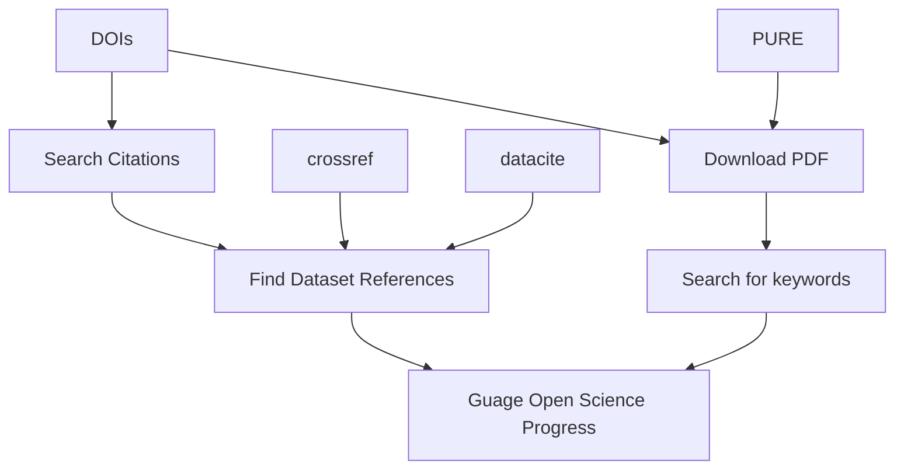

# TNW-Tracking
Tracking Research Objects at the Faculty of Applied Sciences, TU Delft

Evaluation of researcher performance is currently a contested subject within academia. Although many researchers contribute to their field of expertise in a multitude of manners, the most stringent criteria of success is the number of research articles published. Subverting the current “publish or perish” culture requires a novel approach to the evaluation of research objects (such as software, data and methods) other than research articles. However, there is currently no standardised way to track such research objects. This project aims to identify and quantify the role of research objects, in particular research software, within the Faculty of Applied Sciences at TU Delft and evaluate how these are being shared within the research community. By monitoring open research objects such as software, the project aims to stimulate an open research culture and incentivise scientists to adhere to Open Science practices and the FAIR principles.


## Proposal
[eScience Center Fellowship Programme 2024: Application Form Esther Plomp](https://doi.org/10.5281/zenodo.10939832)

## Approach ⚙

The approach used to try to get an idea of how 'well' the faculty is doing is given below. One would manually request a list of DOIs of articles published by the department.

Note that the pdf text content search uses [existing work by Meron Vermaas](https://github.com/meronvermaas/PURE_fulltext_analysis/tree/main)



## Setup 📦

**Python**

All the code is run by a Python frontend. Code is tested on Python `3.10.15`

I suggest you create a new virtual environment and then install the required packages and dependencies into it using:

```shell
python setup.py
```

**PURE information**

You will also need to specify the pure server URL and provide an authentication token. These are entered in [pure-credentials.yaml](pure-credentials.yaml)

**Keywords**

You can specify the keywords you want to look for in the [keywords.txt](find_by_pdf_content/keywords.txt) file in the [find_by_pdf_content](find_by_pdf_content) directory. Articles whose pdf contents contain those keywords will have this listed in the final output files.

**DOIs**

Finally, you have to provide a list of DOIs that the scripts will use as input. These are to be entered into [dois.yaml](dois.yaml)

## Running 🚀

To run the analysis on your list of DOIs, you can simply call the following in the root directory:

```shell
python main.py
```

Of course you can run the different steps individually. Have a look at the contents of `main.py` to see what commands and arguments are required for each command.

> [!IMPORTANT]  
> The code is very much not optimised, and it may take quite a while to run, depending on how many DOIs you want evaluated. On a fast laptop it takes around 10 minutes for 80 DOIs.

## 📝 Prior Art 

There are various prior efforts to tackle the same or related matters. We have collected these in [a separate markdown document](docs/prior_art.md)  
